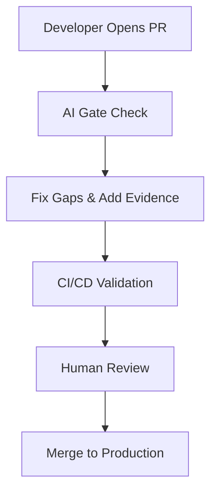

# AI-Enhanced Pull Request Handbook

> A comprehensive, GitHub-native guide for implementing AI-assisted pull request automation and best practices.

## 🎯 TL;DR

Transform your pull request workflow with AI-assisted automation, evidence-based reviews, and standardized templates. This handbook provides everything you need to implement consistent, high-quality PR processes that scale with your team.

## 📚 Documentation

### Core Concepts
- **[Introduction](docs/introduction.md)** - Executive summary, why PR automation matters, and where human review fits
- **[Rules & Configuration](docs/rules.md)** - Core vs conditional rules, rules files, and release rules
- **[Delivery Models](docs/delivery-models.md)** - Trunk-based vs batch delivery approaches

### Templates & Automation
- **[Pull Request Template](templates/pull-request-template.md)** - Copy-paste ready PR template with all required sections
- **[Release Manifest Template](templates/release-manifest-template.md)** - Template for batch release coordination
- **[Automation Tools](docs/automation.md)** - GitHub Actions, Claude integration, and CI/CD workflows

### User Guides
- **[Quick Start Guide](docs/user-guides.md)** - Get up and running in minutes
- **[Workflow Examples](docs/workflows.md)** - Step-by-step PR workflow diagrams
- **[Reference Tables](docs/references.md)** - Evidence links and validation references

## 🚀 Quick Start

1. **Copy the PR Template**: Use our [pull request template](templates/pull-request-template.md) in your repositories
2. **Set up Automation**: Deploy the [GitHub Action workflow](examples/sample-workflows/pr-validation.yml) for PR validation
3. **Configure AI Integration**: Add [Claude configuration](templates/claude-config/) for AI-assisted reviews
4. **Follow the Guide**: Check out our [quick start guide](docs/user-guides.md) for detailed setup

## 📋 What's Included

### ✅ **Ready-to-Use Templates**
- Pull Request template with Core and Conditional sections
- Release Manifest template for batch releases
- GitHub Actions workflow for automated validation
- Claude AI assistant configuration

### ✅ **Comprehensive Guidelines**
- Evidence-based review processes
- AI assistance disclosure requirements
- Security and observability standards
- Risk assessment and rollback strategies

### ✅ **Automation & Integration**
- GitHub Actions for PR validation
- Claude AI integration for automated checks
- CI/CD pipeline integration
- Evidence link validation

## 🎯 Key Benefits

- **🚀 Faster Reviews**: Automated validation reduces manual checklist fatigue
- **📊 Evidence-Based**: Links to tests, scans, and dashboards replace assertions
- **🤖 AI-Assisted**: Leverage AI tools while maintaining human oversight
- **📈 Scalable**: Works for both trunk-based and batch release models
- **🔒 Secure**: Built-in security scanning and compliance checks

## 📖 Example Workflow

See our [complete workflow guide](docs/workflows.md) for detailed examples.

## 🤝 Contributing

We welcome contributions! Please see our [Contributing Guide](CONTRIBUTING.md) for:

- How to propose changes
- Markdown formatting standards
- Preview and testing instructions
- Community guidelines

## 📊 Success Metrics

This handbook has been designed to achieve:

- **75%+ weekly access rate** within 30 days
- **30% reduction** in PR process support requests
- **90%+ satisfaction** rating for new hire onboarding
- **100% team adoption** within three months

## 🔗 Related Resources

- [GitHub Pull Request Best Practices](https://docs.github.com/en/pull-requests)
- [Claude AI Documentation](https://docs.anthropic.com/)
- [GitHub Actions Documentation](https://docs.github.com/en/actions)

## 📄 License

This project is licensed under the MIT License - see the [LICENSE](LICENSE) file for details.

## 🆘 Support

- **Issues**: [Report bugs or request features](https://github.com/your-org/ai-pull-request-handbook/issues)
- **Discussions**: [Community Q&A and best practices](https://github.com/your-org/ai-pull-request-handbook/discussions)
- **Documentation**: All guides are in the `/docs` directory

---

**Ready to transform your PR workflow?** Start with our [Quick Start Guide](docs/user-guides.md) 🚀

