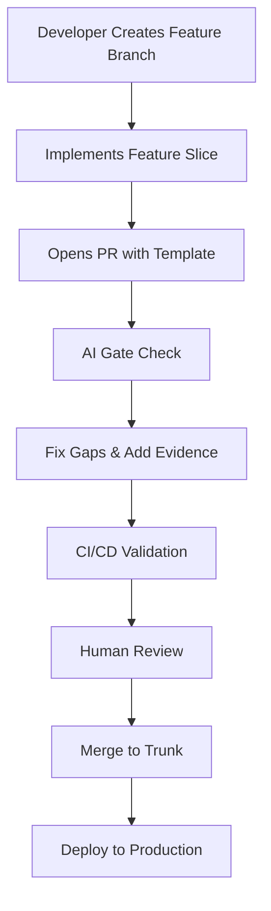
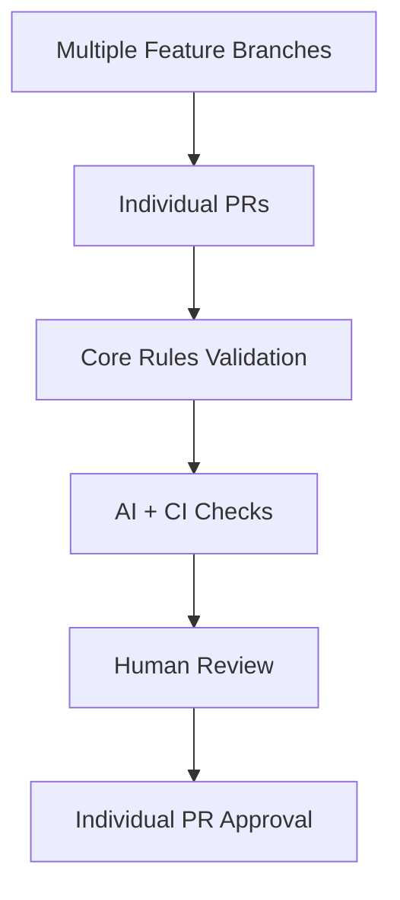
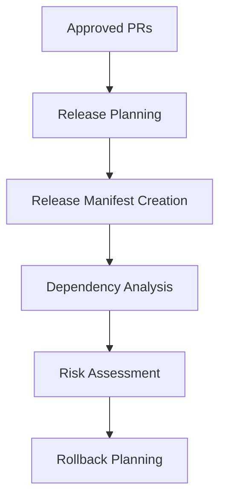
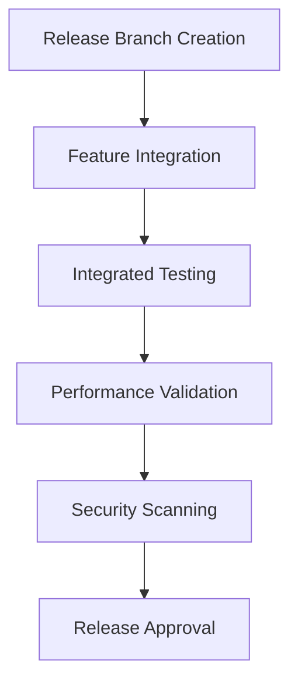
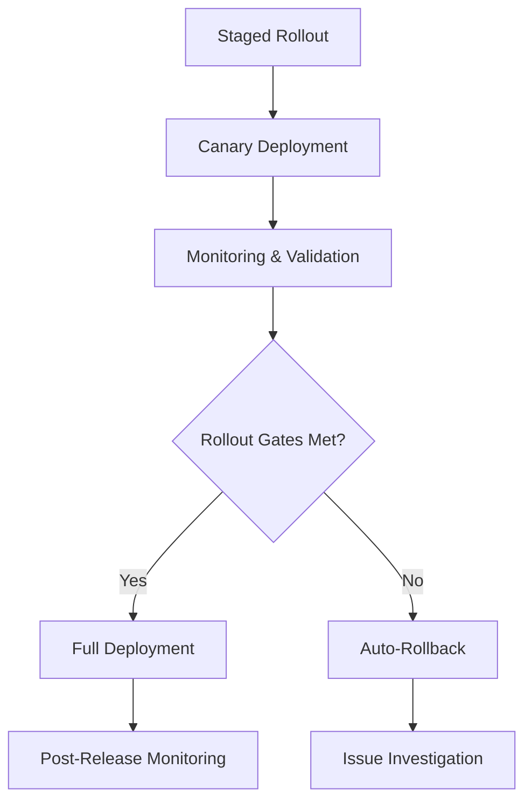

# Delivery Models

## Overview

The AI-Enhanced Pull Request Handbook supports both trunk-based and batch release delivery models. Each model has specific requirements and considerations for PR automation and validation.

---

## Trunk-Based Delivery (Topic Merges)

### Model Description

Trunk-based delivery involves small, frequent merges from short-lived branches into the main branch (trunk). Each PR represents a single feature or slice of work.

### Key Characteristics

- **Small PRs**: Each PR contains a focused, complete feature slice
- **Frequent Merges**: Multiple merges per day to main branch
- **Short-Lived Branches**: Feature branches exist for hours or days, not weeks
- **Continuous Integration**: Every PR triggers full CI/CD pipeline
- **Immediate Feedback**: Fast feedback loops for developers

### PR Requirements for Trunk-Based Delivery

#### **Core Rules Application**
- All Core rules must be satisfied at the PR level
- Each PR must be independently deployable
- No dependencies on other unmerged PRs

#### **AI + CI Validation**
- AI gate checks run on every PR
- CI pipeline validates all Core requirements
- Automated testing and security scanning
- Performance regression detection

#### **Human Review Focus**
- Design and architecture review
- Business logic validation
- Code quality and maintainability
- Risk assessment for individual changes

### Example Trunk-Based Workflow

### Benefits of Trunk-Based with AI Enhancement

- **Faster Integration**: Small PRs integrate quickly
- **Reduced Risk**: Small changes have limited blast radius
- **Better Testing**: Each change thoroughly tested
- **AI Assistance**: AI can focus on smaller, more focused changes
- **Quality Assurance**: Every change meets quality standards

---

## Batch Release Delivery (Release Trains)

### Model Description

Batch release delivery groups multiple features together and deploys them as coordinated "release trains" on scheduled intervals.

### Key Characteristics

- **Feature Batching**: Multiple PRs grouped into releases
- **Scheduled Releases**: Regular release intervals (weekly, bi-weekly, monthly)
- **Coordinated Deployment**: Features deployed together
- **Release Planning**: Advance planning and coordination
- **Staged Rollout**: Gradual deployment with monitoring

### PR Requirements for Batch Delivery

#### **Individual PR Level**
- Each PR must satisfy all Core and relevant Conditional rules
- PR must be ready for release train inclusion
- No blocking dependencies on other PRs in same release

#### **Release Level (Additional Requirements)**
- Release manifest with all included PRs
- Integrated testing across all features
- Migration coordination and planning
- Staged rollout strategy
- Release rollback plan

### Release Train Process

#### **1. Feature Development Phase**

#### **2. Release Planning Phase**

#### **3. Release Integration Phase**

#### **4. Deployment Phase**

### Batch Release Components

#### **Release Manifest**
- **Release Overview**: ID, date, owners, contacts
- **Scope Documentation**: All PRs and features included
- **Risk Assessment**: Combined risk evaluation
- **Rollback Strategy**: Release-level rollback procedures

#### **Integrated Testing**
- **Regression Testing**: Full system regression validation
- **Performance Testing**: Combined performance impact assessment
- **Integration Testing**: Cross-feature integration validation
- **Smoke Testing**: Post-deployment validation

#### **Migration Coordination**
- **Dependency Management**: Feature dependency resolution
- **Data Migration**: Coordinated data transformation
- **Schema Changes**: Database schema coordination
- **Rollback Procedures**: Coordinated rollback strategies

#### **Staged Rollout**
- **Canary Deployment**: Gradual rollout with monitoring
- **Rollout Gates**: Error rate, latency, saturation thresholds
- **Auto-Abort Rules**: Automatic rollback triggers
- **Progressive Rollout**: Percentage-based deployment

### Benefits of Batch Release with AI Enhancement

- **Coordinated Features**: Related features deployed together
- **Reduced Deployment Risk**: Thorough testing and validation
- **Better Planning**: Advance coordination and preparation
- **AI-Assisted Planning**: AI helps with dependency analysis
- **Comprehensive Validation**: Release-level quality assurance

---

## Choosing Your Delivery Model

### When to Use Trunk-Based Delivery

#### **Advantages**
- ✅ Faster feedback and integration
- ✅ Reduced merge conflicts
- ✅ Better continuous integration
- ✅ Lower risk per change
- ✅ More frequent production validation

#### **Best For**
- **Small Teams**: Easier to coordinate
- **Mature CI/CD**: Robust automation pipeline
- **Feature Flags**: Safe feature toggling
- **High-Frequency Deployments**: Multiple daily releases
- **Independent Features**: Low coupling between changes

#### **Requirements**
- **Robust Testing**: Comprehensive automated testing
- **Feature Flags**: Safe deployment mechanisms
- **Monitoring**: Real-time production monitoring
- **Rollback Capability**: Quick rollback procedures

### When to Use Batch Release Delivery

#### **Advantages**
- ✅ Coordinated feature delivery
- ✅ Comprehensive testing and validation
- ✅ Better release planning and communication
- ✅ Reduced deployment complexity
- ✅ Staged rollout control

#### **Best For**
- **Large Teams**: Multiple teams and features
- **Complex Dependencies**: Interdependent features
- **Regulated Environments**: Compliance requirements
- **Customer Communication**: Scheduled feature announcements
- **Integration Testing**: Complex system integration

#### **Requirements**
- **Release Planning**: Advance coordination and planning
- **Integration Testing**: Comprehensive system testing
- **Rollback Planning**: Coordinated rollback procedures
- **Monitoring**: Release-level monitoring and validation

---

## Hybrid Approaches

### Feature Flag Trunk-Based
- **Trunk-Based**: Small PRs merged frequently
- **Feature Flags**: Features deployed but not enabled
- **Batch Activation**: Features activated in coordinated releases
- **Benefits**: Fast integration + controlled activation

### Micro-Release Trains
- **Small Batches**: More frequent, smaller releases
- **Focused Scope**: Limited number of features per release
- **Faster Feedback**: Reduced time between releases
- **Benefits**: Balance between speed and coordination

### Progressive Delivery
- **Trunk-Based Development**: Fast integration and feedback
- **Batch Deployment**: Coordinated production deployment
- **Staged Rollout**: Gradual feature activation
- **Benefits**: Best of both approaches

---

## Migration Between Models

### From Trunk-Based to Batch Release

#### **Preparation Steps**
1. **Implement Release Planning**: Establish release planning process
2. **Create Release Infrastructure**: Build release manifest and tracking
3. **Develop Integration Testing**: Comprehensive system testing
4. **Train Teams**: Educate teams on batch release process

#### **Migration Process**
1. **Parallel Running**: Run both models during transition
2. **Feature Batching**: Start batching related features
3. **Process Refinement**: Iterate on batch release process
4. **Full Transition**: Complete migration to batch model

### From Batch Release to Trunk-Based

#### **Preparation Steps**
1. **Implement Feature Flags**: Safe deployment mechanisms
2. **Enhance CI/CD**: Robust automated testing and deployment
3. **Improve Monitoring**: Real-time production monitoring
4. **Train Teams**: Educate teams on trunk-based practices

#### **Migration Process**
1. **Feature Flag Implementation**: Add feature toggles
2. **Small PR Practice**: Break features into smaller slices
3. **Continuous Deployment**: Implement automated deployment
4. **Full Transition**: Complete migration to trunk-based model

---

## AI Enhancement for Both Models

### Trunk-Based AI Assistance
- **Focused Validation**: AI validates small, focused changes
- **Fast Feedback**: Quick AI gate checks for rapid iteration
- **Quality Consistency**: Consistent quality across all small PRs
- **Risk Assessment**: AI-assisted risk evaluation for individual changes

### Batch Release AI Assistance
- **Dependency Analysis**: AI helps identify feature dependencies
- **Release Planning**: AI-assisted release manifest creation
- **Integration Validation**: AI validates cross-feature integration
- **Rollout Optimization**: AI-assisted rollout strategy planning

### Universal AI Benefits
- **Rule Enforcement**: Consistent application of quality rules
- **Evidence Validation**: Automated validation of test results and scans
- **Gap Identification**: AI identifies missing requirements
- **Suggestion Generation**: AI proposes improvements and fixes

---

## Next Steps

- **[Set Up Your Model](automation.md)** - Configure automation for your chosen delivery model
- **[Create Templates](templates/)** - Use appropriate templates for your delivery model
- **[Implement Automation](automation.md)** - Set up AI and CI/CD integration
- **[Train Your Team](user-guides.md)** - Educate teams on your delivery model

---

**Ready to implement your delivery model?** Start with our [Automation Setup Guide](automation.md) 🚀

