# PR Workflows & Processes

## PR Workflow Diagram

The AI-Enhanced Pull Request workflow integrates human expertise with AI assistance and automated validation to ensure consistent, high-quality code changes.

### High-Level Workflow

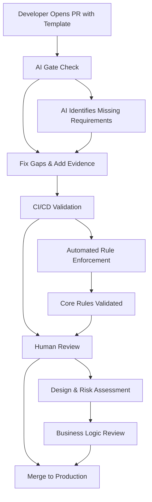

### Detailed Workflow Steps

#### 1. Developer Opens PR with Template
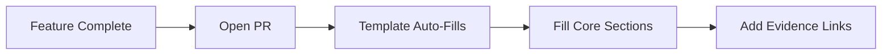

**What happens:**
- Developer completes feature development
- Opens pull request in GitHub
- PR template automatically populates
- Developer fills in required sections with evidence links

#### 2. AI Gate Check
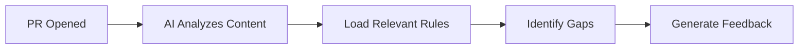

**What happens:**
- AI assistant (Claude/Copilot) analyzes PR content
- Loads relevant rule files (Core + Conditional)
- Identifies missing requirements and evidence
- Generates specific, actionable feedback

#### 3. Fix Gaps & Add Evidence
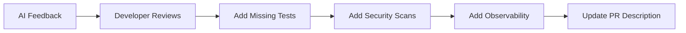

**What happens:**
- Developer reviews AI feedback
- Adds missing tests, security scans, documentation
- Updates PR description with evidence links
- Marks Conditional rules as N/A where appropriate

#### 4. CI/CD Validation
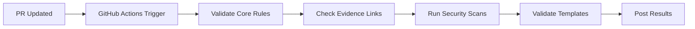

**What happens:**
- GitHub Actions workflow triggers on PR update
- Validates all Core rules are satisfied
- Checks evidence links are accessible
- Runs automated security scans
- Posts validation results as PR comment

#### 5. Human Review
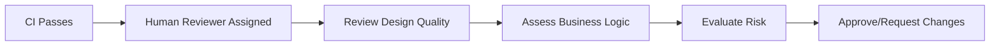

**What happens:**
- Human reviewer focuses on design and architecture
- Evaluates business logic and product alignment
- Assesses production risk and tradeoffs
- Reviews code maintainability and clarity

#### 6. Merge to Production
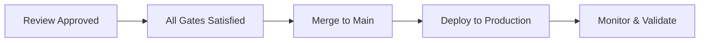

**What happens:**
- All validation gates are satisfied
- PR merges to main branch
- Automated deployment to production
- Monitoring and validation of changes

---

## Workflow Variations by Delivery Model

### Trunk-Based Delivery Workflow

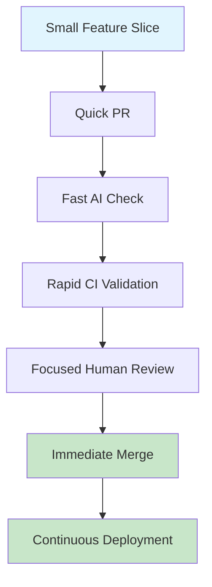

**Characteristics:**
- Small, focused PRs
- Fast feedback loops
- Continuous integration
- Immediate deployment

### Batch Release Workflow

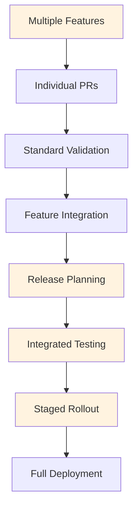

**Characteristics:**
- Coordinated feature delivery
- Comprehensive integration testing
- Staged rollout with monitoring
- Release-level validation

---

## Role-Based Workflow Responsibilities

### Developer Workflow

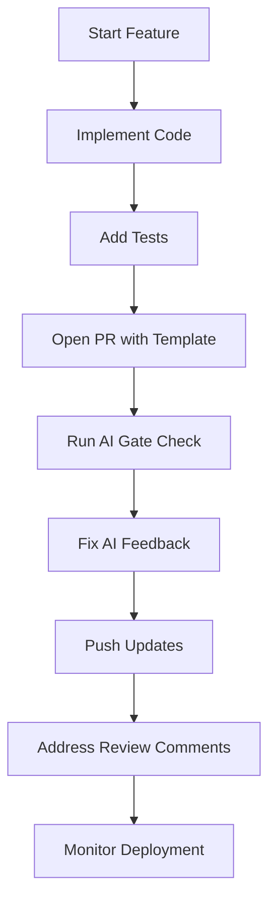

**Developer Responsibilities:**
- Implement feature with tests
- Use PR template correctly
- Respond to AI feedback
- Provide evidence links
- Address human review feedback

### AI Assistant Workflow

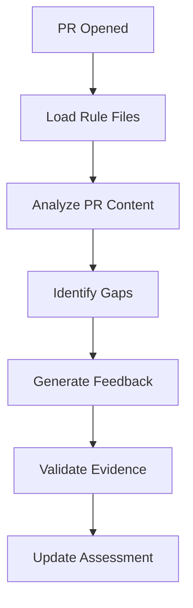

**AI Assistant Responsibilities:**
- Load relevant rule files
- Analyze PR against rules
- Identify missing requirements
- Generate actionable feedback
- Validate evidence links

### CI/CD Workflow

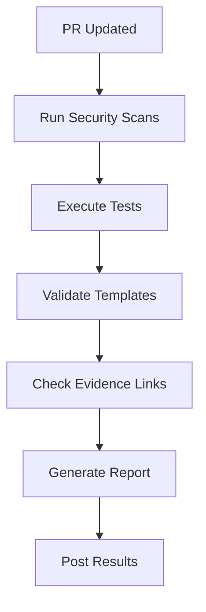

**CI/CD Responsibilities:**
- Run automated security scans
- Execute test suites
- Validate PR template compliance
- Check evidence link accessibility
- Generate validation reports

### Human Reviewer Workflow

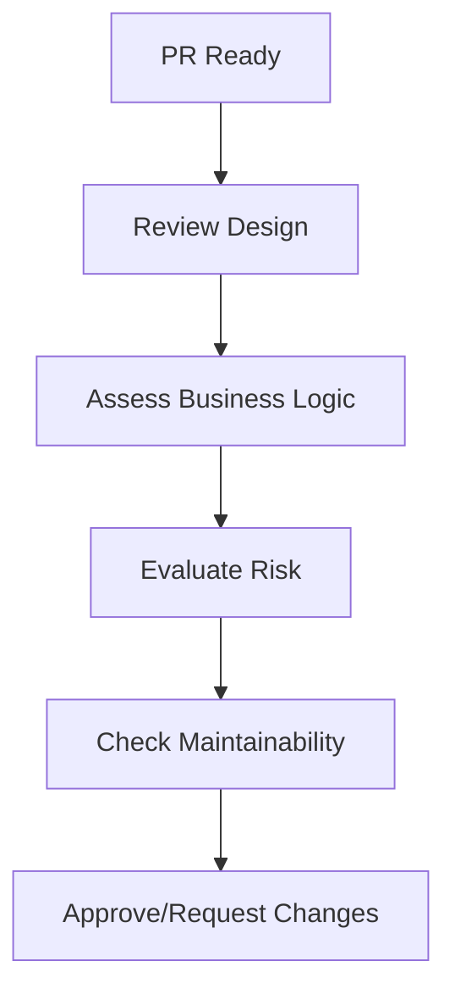

**Human Reviewer Responsibilities:**
- Review design and architecture
- Validate business logic
- Assess production risk
- Evaluate code maintainability
- Provide final approval

---

## Workflow Integration Points

### GitHub Integration

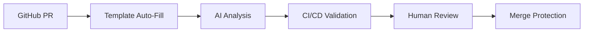

**GitHub Features Used:**
- PR templates for consistent structure
- GitHub Actions for automated validation
- Branch protection rules
- Required status checks
- Review requirements

### AI Tool Integration

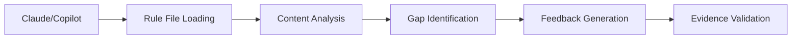

**AI Tool Features:**
- Rule file interpretation
- Content analysis and validation
- Gap identification and suggestions
- Evidence link validation
- Continuous learning and improvement

### CI/CD Integration

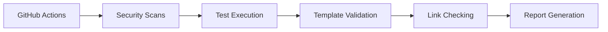

**CI/CD Features:**
- Automated security scanning
- Test execution and reporting
- Template validation
- Link accessibility checking
- Comprehensive reporting

---

## Workflow Optimization Strategies

### Speed Optimization

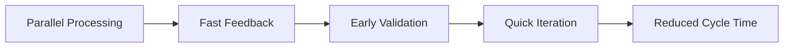

**Strategies:**
- Run AI checks in parallel with CI/CD
- Provide immediate feedback on template compliance
- Validate evidence links early in process
- Enable quick iteration and fixes

### Quality Optimization

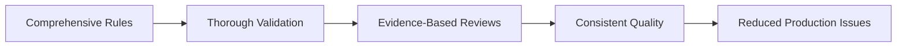

**Strategies:**
- Comprehensive rule coverage
- Evidence-based validation
- Consistent quality standards
- Proactive issue prevention

### Collaboration Optimization

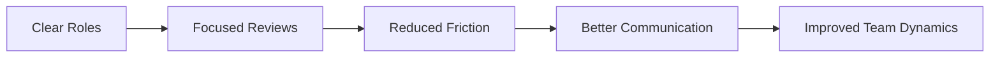

**Strategies:**
- Clear role definitions
- Focused review responsibilities
- Reduced review fatigue
- Better team collaboration

---

## Workflow Monitoring & Metrics

### Key Performance Indicators

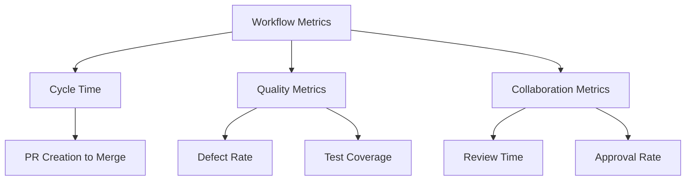

**Metrics to Track:**
- **Cycle Time**: PR creation to merge
- **Quality**: Defect rate, test coverage
- **Collaboration**: Review time, approval rate
- **Automation**: AI check accuracy, CI/CD success rate

### Monitoring Dashboard

```mermaid
graph LR
    A[Workflow Events] --> B[Metrics Collection]
    B --> C[Dashboard Updates]
    C --> D[Alert Generation]
    D --> E[Team Notifications]
```

**Dashboard Components:**
- PR workflow status
- AI check results
- CI/CD pipeline health
- Review metrics
- Quality trends

---

## Workflow Troubleshooting

### Common Issues and Solutions

#### Issue: AI Check Fails
**Problem**: AI assistant reports missing requirements
**Solution**:
1. Review AI feedback carefully
2. Add missing evidence links
3. Mark Conditional rules as N/A if appropriate
4. Re-run AI check after updates

#### Issue: CI/CD Validation Fails
**Problem**: GitHub Actions reports rule violations
**Solution**:
1. Check CI logs for specific failures
2. Ensure all Core rules are satisfied
3. Verify evidence links are accessible
4. Fix formatting issues in PR description

#### Issue: Human Review Takes Too Long
**Problem**: Reviewers spend too much time on checklist items
**Solution**:
1. Ensure AI and CI have validated all mechanical requirements
2. Focus human review on design and business logic
3. Provide clear evidence links for quality measures
4. Train reviewers on new workflow

#### Issue: Merge Conflicts
**Problem**: Multiple PRs cause merge conflicts
**Solution**:
1. Keep PRs small and focused
2. Coordinate with team on overlapping changes
3. Use feature flags to avoid conflicts
4. Implement proper branching strategy

---

## Workflow Evolution

### Continuous Improvement

```mermaid
graph LR
    A[Current Workflow] --> B[Collect Feedback]
    B --> C[Identify Improvements]
    C --> D[Implement Changes]
    D --> E[Measure Impact]
    E --> F[Iterate Process]
```

**Improvement Process:**
1. Collect feedback from team
2. Identify pain points and bottlenecks
3. Implement workflow improvements
4. Measure impact of changes
5. Iterate based on results

### Workflow Scaling

```mermaid
graph LR
    A[Small Team] --> B[Basic Workflow]
    B --> C[Growing Team]
    C --> D[Enhanced Workflow]
    D --> E[Large Organization]
    E --> F[Enterprise Workflow]
```

**Scaling Considerations:**
- Start with basic workflow
- Add complexity as team grows
- Implement enterprise features for large organizations
- Maintain simplicity and usability

---

## Next Steps

- **[User Guides](user-guides.md)** - Learn how to use the workflow effectively
- **[Automation](automation.md)** - Set up AI and CI/CD integration
- **[Delivery Models](delivery-models.md)** - Choose your team's workflow approach
- **[References](references.md)** - Evidence links and validation guides

---

**Ready to implement the workflow?** Start with our [User Guides](user-guides.md) for step-by-step instructions! 🚀

